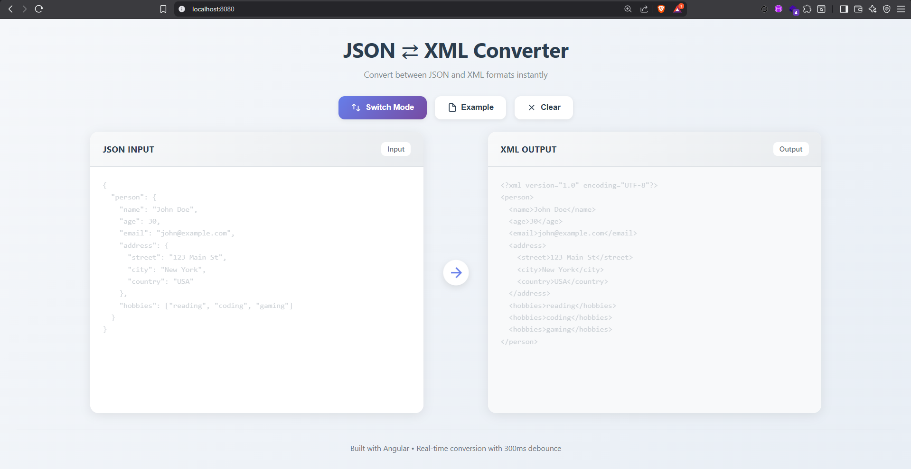
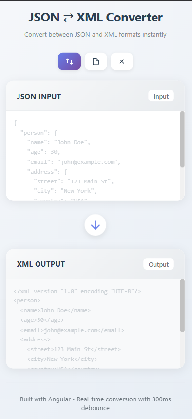

# 🔄 Conversor JSON ⇄ XML

Una hermosa y moderna SPA de Angular para convertir entre formatos JSON y XML en tiempo real.


## 📸 Vista Previa



## ✨ Características

| Característica | Descripción |
|----------------|-------------|
| 🔄 **Conversión Bidireccional** | Convierte JSON → XML y XML → JSON con un solo clic |
| ⚡ **Procesamiento en Tiempo Real** | Conversión instantánea con debounce de 300ms |
| ✅ **Validación Inteligente** | Validación de entrada en tiempo real con mensajes de error claros |
| 🎯 **Cambio de Modo** | Cambia la dirección de conversión con un solo botón |
| 🎨 **Interfaz Moderna** | Diseño minimalista con animaciones suaves |
| 📱 **Diseño Responsivo** | Funciona perfectamente en escritorio, tableta y móvil |
| 📄 **Datos de Ejemplo** | Carga datos de muestra con un clic |
| 🎯 **Formato Limpio** | Formato de código limpio y legible |
| 🔒 **Type-Safe** | Construido con TypeScript y mejores prácticas de Angular |

## 🚀 Inicio Rápido

### 📋 Requisitos Previos

| Opción | Requisitos |
|--------|-----------|
| **Desarrollo** | Node.js (v18+) y npm (v9+) |
| **Producción** | Docker y Docker Compose |

---

### 🛠️ Opción 1: Modo Desarrollo

| Paso | Comando | Descripción |
|------|---------|-------------|
| 1️⃣ | `cd d:\json-to-xml` | Navega al directorio del proyecto |
| 2️⃣ | `npm install` | Instala las dependencias |
| 3️⃣ | `npm start` | Inicia el servidor de desarrollo |
| 4️⃣ | Abre `http://localhost:4200` | Accede a la aplicación |

> 💡 **Nota:** La aplicación se recargará automáticamente cuando realices cambios en los archivos.

---

### 🐳 Opción 2: Despliegue con Docker (Producción)

#### Inicio Rápido

```bash
# Construir y ejecutar
docker-compose up -d

# Acceder a la aplicación
# http://localhost:8080

# Detener el contenedor
docker-compose down
```

#### Comandos Alternativos de Docker

| Acción | Comando |
|--------|---------|
| **Construir imagen** | `docker build -t json-xml-converter .` |
| **Ejecutar contenedor** | `docker run -d -p 8080:80 --name json-xml-converter json-xml-converter` |
| **Detener** | `docker stop json-xml-converter` |
| **Eliminar** | `docker rm json-xml-converter` |
| **Ver logs** | `docker logs json-xml-converter` |
| **Reiniciar** | `docker restart json-xml-converter` |

## 📦 Compilación para Producción

```bash
npm run build
```

Los artefactos de compilación se almacenarán en el directorio `dist/`.

---

## 🏗️ Estructura del Proyecto

| Directorio/Archivo | Descripción |
|-------------------|-------------|
| 📁 **src/app/services/** | |
| └─ `conversion.service.ts` | ⚙️ Lógica central de conversión |
| 📁 **src/app/** | |
| └─ `app.component.ts` | 🎯 Componente principal |
| └─ `app.component.html` | 📄 Plantilla HTML |
| └─ `app.component.scss` | 🎨 Estilos del componente |
| └─ `app.config.ts` | ⚙️ Configuración de la aplicación |
| 📁 **src/** | |
| └─ `styles.scss` | 🌐 Estilos globales |
| └─ `main.ts` | 🚀 Bootstrap de la aplicación |
| └─ `index.html` | 📄 Punto de entrada HTML |
| 📁 **/** | |
| └─ `angular.json` | ⚙️ Configuración de Angular CLI |
| └─ `package.json` | 📦 Dependencias del proyecto |
| └─ `tsconfig.json` | 📘 Configuración de TypeScript |
| └─ `Dockerfile` | 🐳 Configuración de Docker |
| └─ `docker-compose.yml` | 🐳 Orquestación de contenedores |

## 🎯 Guía de Uso

### 📋 Conversión JSON → XML

| Paso | Acción |
|------|--------|
| 1️⃣ | El panel izquierdo acepta entrada JSON por defecto |
| 2️⃣ | Escribe o pega tus datos JSON |
| 3️⃣ | La salida XML aparece automáticamente en el panel derecho |

### 📋 Conversión XML → JSON

| Paso | Acción |
|------|--------|
| 1️⃣ | Haz clic en el botón "Switch Mode" (Cambiar Modo) |
| 2️⃣ | Escribe o pega tus datos XML en el panel izquierdo |
| 3️⃣ | La salida JSON aparece automáticamente en el panel derecho |

### 🎛️ Funciones Adicionales

| Botón | Función | Descripción |
|-------|---------|-------------|
| 🔄 **Switch Mode** | Cambiar modo | Alterna entre JSON→XML y XML→JSON |
| 📄 **Example** | Cargar ejemplo | Carga datos de muestra para probar |
| ❌ **Clear** | Limpiar | Limpia todas las entradas y salidas |

## 🛠️ Stack Tecnológico

| Categoría | Tecnología | Versión/Detalles |
|-----------|------------|------------------|
| 🎯 **Framework** | Angular | v17 (Componentes Standalone) |
| 📘 **Lenguaje** | TypeScript | v5.2 |
| 🎨 **Estilos** | SCSS | Con animaciones personalizadas |
| 🔄 **Estado** | RxJS | Observables reactivos |
| 📄 **Procesamiento XML** | Nativo | DOMParser & XMLSerializer |
| 🔧 **Herramienta Build** | Angular CLI | Webpack integrado |
| 🐳 **Contenedor** | Docker | Multi-stage build |
| 🌐 **Servidor Web** | Nginx | Alpine (Producción) |

---

## 🎨 Arquitectura

### 🔧 Servicio de Conversión (`ConversionService`)

| Método | Parámetros | Retorno | Descripción |
|--------|-----------|---------|-------------|
| `jsonToXml()` | `jsonString: string` | `ConversionResult` | Convierte JSON a XML |
| `xmlToJson()` | `xmlString: string` | `ConversionResult` | Convierte XML a JSON |
| `validateJson()` | `input: string` | `ValidationResult` | Valida sintaxis JSON |
| `validateXml()` | `input: string` | `ValidationResult` | Valida sintaxis XML |

### ⚡ Características del Componente

| Característica | Tecnología | Beneficio |
|----------------|------------|-----------|
| **Entrada Debounced** | RxJS (300ms) | Previene conversiones excesivas |
| **Type Safety** | TypeScript | Tipado fuerte en todos los métodos |
| **Manejo de Errores** | Try/Catch + Validación | Mensajes de error comprensivos |
| **Actualizaciones Reactivas** | Angular Change Detection | Actualizaciones instantáneas de UI |

## 🎯 Mejores Prácticas Implementadas

| Categoría | Práctica | Estado |
|-----------|----------|--------|
| 🏗️ **Arquitectura** | Componentes standalone (Angular 17+) | ✅ |
| 📘 **TypeScript** | Tipado fuerte en todo el código | ✅ |
| 🎯 **Diseño** | Arquitectura basada en servicios | ✅ |
| 🔄 **Programación Reactiva** | RxJS para manejo de eventos | ✅ |
| 🧹 **Limpieza de Recursos** | Cleanup apropiado con `takeUntil` | ✅ |
| 🎨 **Estilos** | SCSS con nomenclatura inspirada en BEM | ✅ |
| 📱 **Responsive** | CSS Flexbox para diseño adaptable | ✅ |
| ♿ **Accesibilidad** | Consideraciones de accesibilidad | ✅ |
| 🔒 **Seguridad** | Headers de seguridad en Nginx | ✅ |
| ⚡ **Performance** | Compresión Gzip y caché optimizado | ✅ |

## 📝 Datos de Ejemplo

### 📊 Ejemplo JSON
```json
{
  "person": {
    "name": "John Doe",
    "age": 30,
    "email": "john@example.com",
    "hobbies": ["reading", "coding", "gaming"]
  }
}
```

### 📄 Ejemplo XML
```xml
<?xml version="1.0" encoding="UTF-8"?>
<person>
  <name>John Doe</name>
  <age>30</age>
  <email>john@example.com</email>
  <hobbies>reading</hobbies>
  <hobbies>coding</hobbies>
  <hobbies>gaming</hobbies>
</person>
```

---

## 🚀 Comandos Útiles

| Comando | Descripción |
|---------|-------------|
| `npm start` | Inicia servidor de desarrollo |
| `npm run build` | Compila para producción |
| `npm test` | Ejecuta pruebas unitarias |
| `docker-compose up -d` | Levanta contenedor en segundo plano |
| `docker-compose logs -f` | Ver logs en tiempo real |
| `docker-compose down` | Detiene y elimina contenedor |

---

## 🤝 Contribuir

¡Las contribuciones son bienvenidas! Siéntete libre de enviar issues y pull requests.

### Cómo contribuir

| Paso | Acción |
|------|--------|
| 1️⃣ | Fork el repositorio |
| 2️⃣ | Crea una rama (`git checkout -b feature/AmazingFeature`) |
| 3️⃣ | Commit tus cambios (`git commit -m 'Add some AmazingFeature'`) |
| 4️⃣ | Push a la rama (`git push origin feature/AmazingFeature`) |
| 5️⃣ | Abre un Pull Request |

---

## 📄 Licencia

Este proyecto es código abierto y está disponible bajo la Licencia MIT.

---

## 🙏 Reconocimientos

| Elemento | Tecnología/Fuente |
|----------|-------------------|
| 🎯 **Framework** | Angular 17 |
| 🎨 **Iconos** | SVG personalizados |
| 🔤 **Fuentes** | System fonts (rendimiento óptimo) |
| 🐳 **Contenedor** | Docker & Nginx Alpine |
| 📦 **Gestión de paquetes** | npm |

---

<div align="center">

### ¡Disfruta convirtiendo! 🎉

**Desarrollado con ❤️ usando Angular**

[⬆ Volver arriba](#-conversor-json--xml)

</div>
